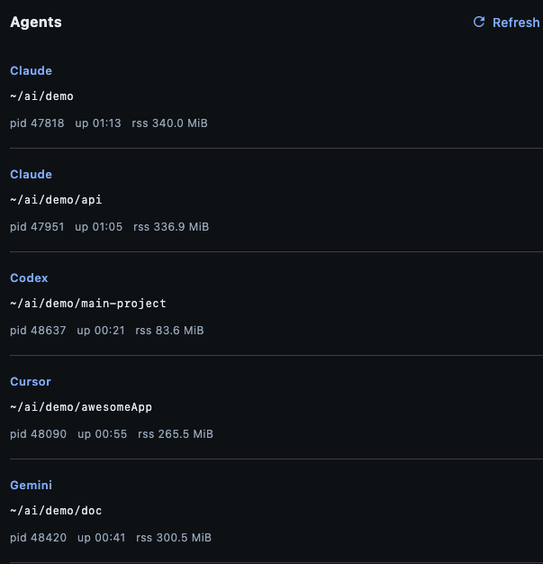

# Running agent tracker

Desktop utility (Compose for Desktop, dark Material 3 UI) that lists **terminal / CLI agent processes**: **label**, **cwd**, **PID**, **`ps` uptime**, and **RSS**. **Claude Desktop** (the `.app` GUI) is **intentionally ignored** so the list matches “what’s running in the shell,” not the Electron app.

## Who gets detected

Processes whose command line matches heuristics in `RunningAgents.kt` (Claude Code, **Codex** — including `@openai/codex`, bare `codex`, `openai.cli.codex`, **Gemini** CLI, Hermes, Cursor, …). **Terminal emulators are not listed** — only the agent CLI process (e.g. `gemini`, `@google/gemini-cli`, `npx … gemini`). Gemini matches `@google/genai`, `uvx … gemini`, `gcloud … gemini`, bare `gemini` on `PATH`, etc. If something is missing, run `ps axww | grep -iE 'gemini|claude'` and extend the regex list.

**Idle / waiting** is normal: most agent processes sleep between I/O and tool calls. **Active** (`R`) may appear only briefly in a 5s snapshot.

## Requirements

- **JDK 17+**
- **macOS** or **Linux** for `ps` and cwd resolution (`lsof` on macOS for cwd when `/proc` is not used)

If **cwd** stays unknown or wrong, the tracker process must be allowed to inspect others: on macOS grant **Full Disk Access** (or equivalent) to the JVM/terminal running the app so `lsof` can read cwd; on Linux run as a user that can read `/proc/<pid>/cwd` and run `lsof`.

## Run from the repo

**Desktop window** (Compose UI):

```bash
./gradlew run
# or shorter alias:
./gradlew agents
```

**Terminal UI only** (ANSI refresh loop — use inside **GNU screen**, **tmux**, SSH, or whenever you want **no Swing window** even if you have a display):

```bash
AGENT_TRACKER_TERMINAL=1 ./gradlew agents
```

Same effect via Gradle (forwards `-Dagent.tracker.terminal=true` into the app JVM):

```bash
./gradlew agents -PagentTrackerTerminal
./gradlew agents -Ptty
```

Or when launching with `java` directly:

```bash
java -Dagent.tracker.terminal=true -jar …
```

If there is **no** graphical display, the app uses the terminal UI **automatically**; the options above **force** that mode when a display exists.

## Example output

### Terminal (CLI)

Sample session (paths are illustrative; your processes and timings will differ):

```text
      .___.
      /     \    ___
  /--|  (o o)  |--\   Running agents
 /   |  \ ^ /  |   \
/    '.__\m/__.'    \
       /  >>  \ ~~  ~ ps + cwd ~
      /________\

══ Agent tracker (headless · CLIs only · no Claude Desktop) ══
15:24:51  ·  every 5s  ·  Ctrl+C to quit

  6 process(es)

  Claude  Idle / waiting  ps S+
     cwd  ~/ai/demo
    up 02:43 · CPU 0.8% · RSS 340.0 MiB
     pid 47818 · claude

  Claude  Idle / waiting  ps S+
     cwd  ~/ai/demo/api
    up 02:35 · CPU 0.2% · RSS 336.8 MiB
     pid 47951 · claude

  Codex  Idle / waiting  ps S+
     cwd  ~/ai/demo/main-project
    up 01:51 · CPU 0.0% · RSS 84.1 MiB
     pid 48637 · codex

  Cursor  Idle / waiting  ps S+
     cwd  ~/ai/demo/awesomeApp
    up 02:25 · CPU 0.0% · RSS 229.0 MiB
     pid 48090 · ~/.local/bin/cursor-agent --use-system-ca ~/.local/share/cursor/…

  Gemini  Idle / waiting  ps S+
     cwd  ~/ai/demo/doc
    up 02:11 · CPU 0.0% · RSS 222.1 MiB
     pid 48420 · node --no-warnings=DEP0040 /opt/homebrew/bin/gemini

  Gemini  Idle / waiting  ps S+
     cwd  ~/ai/demo/doc
    up 02:03 · CPU 0.0% · RSS 244.1 MiB
     pid 48504 · /opt/homebrew/Cellar/node/25.8.1_1/bin/node --no-warnings=DEP0040 /opt/homebrew/bin/gemini
```

### Desktop app



*(Placeholder: add `docs/desktop-screenshot.png` when you have the image.)*

## Packaging

```bash
./gradlew packageDistributionForCurrentOS
```

Installable artifacts land under `build/compose/binaries/` (layout depends on OS).

## Stack

- Kotlin **2.3.20**, Compose Multiplatform **1.10.2**
